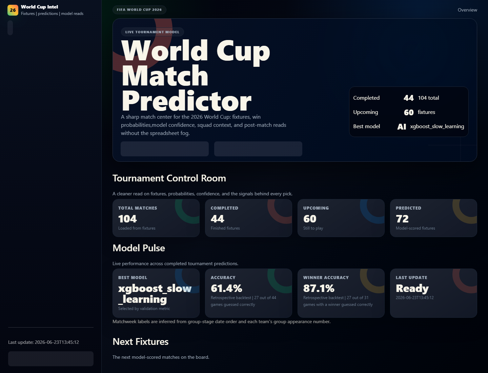
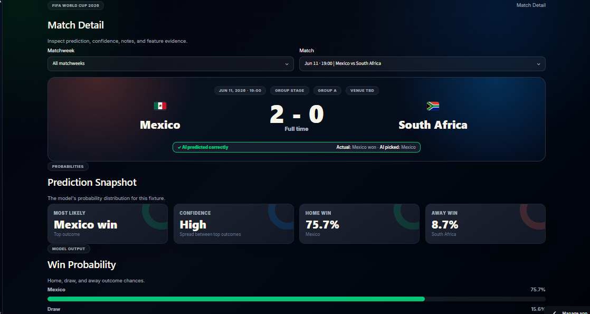

# World Cup Match Predictor

A Streamlit web app and machine-learning pipeline for exploring FIFA World Cup 2026 fixtures, match probabilities, team form, model performance, and generated match analysis.

The app combines historical international results, FIFA ranking inputs, squad and lineup data, Elo-style features, optional FotMob-derived context, and saved model reports into an interactive match center.

## Live Demo

Open the hosted app:

<https://worldcup-match-predictor.streamlit.app>

## Screenshots





## Features

- Interactive dashboard for fixtures, predictions, match detail, model performance, and data exploration.
- Historical feature pipeline using Elo, recent form, neutral-site context, and tournament importance signals.
- Saved fixture predictions with generated plain-English match analysis.
- Model comparison, feature importance, and evaluation reports for transparency.
- Optional data refresh scripts for football-data.org and FotMob enrichment.

## Tech Stack

- Python
- Streamlit
- pandas and NumPy
- scikit-learn
- XGBoost
- Matplotlib

## Run Locally

Clone the repository and install the Python dependencies:

```bash
git clone <repository-url>
cd worldcup-match-predictor
python -m venv .venv
```

Activate the virtual environment:

```bash
# Windows PowerShell
.\.venv\Scripts\Activate.ps1

# macOS/Linux
source .venv/bin/activate
```

Install dependencies and start the app:

```bash
pip install -r requirements.txt
streamlit run app.py
```

Streamlit will print a local URL, usually `http://localhost:8501`.

## Command-Line Usage

Run a single neutral-site matchup:

```bash
python src/predict_match.py "Brazil" "France"
```

Generate predictions for the fixture file:

```bash
python src/predict_match.py --all-fixtures
```

Rebuild the local pipeline:

```bash
python src/run_pipeline.py
```

Optional pipeline modes:

```bash
python src/run_pipeline.py --with-fixtures
python src/run_pipeline.py --with-squads
python src/run_pipeline.py --with-fotmob
python src/run_pipeline.py --with-analysis
python src/run_pipeline.py --update-predictions
```

## Environment Variables

The dashboard can run from the included CSV and report artifacts without an API key.

API-backed data collection uses football-data.org. To enable it, copy the example environment file:

```bash
cp .env.example .env
```

On Windows PowerShell:

```powershell
Copy-Item .env.example .env
```

Then set:

```text
FOOTBALL_DATA_API_KEY=your_football_data_org_api_key_here
FOOTBALL_DATA_BASE_URL=https://api.football-data.org/v4
FOOTBALL_DATA_WORLD_CUP_CODE=WC
FOOTBALL_DATA_SEASON=2026
```

## Project Structure

```text
.
+-- app.py                         # Streamlit dashboard entrypoint
+-- assets/                        # App icon and README screenshots
+-- data/
|   +-- raw/                       # Source CSV inputs
|   +-- processed/                 # Engineered datasets
+-- models/                        # Model metadata and prediction policy
+-- notebooks/                     # Exploratory validation notebooks
+-- reports/                       # Evaluation, predictions, and match analysis outputs
+-- scripts/                       # Optional Windows scheduled-task helpers
+-- src/                           # Collection, training, evaluation, prediction, and web helpers
+-- requirements.txt               # Python dependencies
+-- tokens.css                     # Dashboard styling
```

## Data and Model Notes

- `data/raw/fixtures.csv` powers the fixture list.
- `reports/fixture_predictions.csv` stores saved model-scored fixtures.
- `reports/match_analysis/*.json` and `.txt` files power the detailed match explanations.
- `models/model_metadata.json` and `models/prediction_policy.json` document the selected model and prediction policy.
- Trained `.pkl` files are ignored because they are generated artifacts and can be large. Rebuild them locally with the pipeline when needed.

Predictions are probabilistic model outputs, not betting advice. They are intended for exploring team signals, model uncertainty, and historical fixture context.
